> Note: Letslink also named Link, Letslink Development Team has provided the official download page of the app. Users can download Letslink through the github page, please check and make sure the **letslink.git** repository .  


# Download & installation guidance of Letslink（iOS version）

Please click [here](https://apps.apple.com/cn/app/letslink/id1542556918) to download Letslink.

Or copy the link below to your browser to download. (The link only support iOS version)

```html
https://apps.apple.com/cn/app/letslink/id1542556918

```


# Download & installation guidance of Letslink（Android version）

## Download& Installation guidance

**1、Download Letslink** 

Please click [here](https://github.com/syosan/letslink/raw/master/apps/Link_android_5.4.12.apk) to download Letslink.

Or copy the link below to your browser to download. (The link only support android version)

```html
https://github.com/syosan/letslink/raw/master/apps/Link_android_5.4.12.apk

```

When you download Letslink from this link above, the device might possibly remind you the risk or warn you it might be harmful, choose download anyway to continue the download (According to the differences of mobile devices, the remind preferences would be different, just click trust to complete the download task. In some cases, the option ‘continue to download’ may be hidden in more options, and click more to choose continue to download) 

Note: The warnings come from mobile system, app installation from the sources which untrusted or unknown by the original system will receive the warnings, as a result please **make sure you download the app from the https://github.com/syosan/letslink.git**. And we declare again, Letslink Development Team do not collect or use User's information without permission for any illegal or commercial purposes.  This is the privacy agreement of Letslink, please check.

[Letslink Privacy Agreement](https://mapsales.midea.com/LetslinkPrivateEN.html)

 

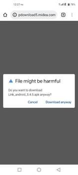 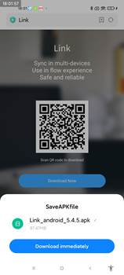

 **2、When you completed the download, click the apk file to install**

 PS：As the app came from the source which is untrusted by the original system, the installation may be reminded risks or be warned as well. Just allow it and complete the installation.

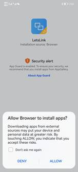

## FAQ

1、 If your browser cannot open apk file, you need to install the app via other tools as ‘apk installer’

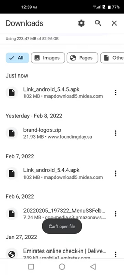

​				a) Install ‘apk installer’from google play 

​					Let’s take this ‘apk installer’ as an example. Install it from google play.

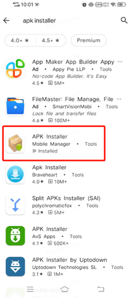

​				b) Open apk installer，and choose Local apks and find Letslink to install

​                     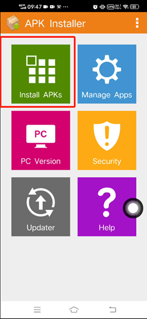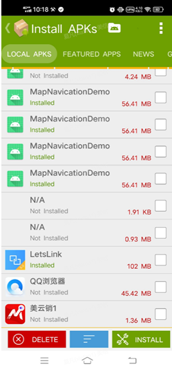

 2、If you cannot install the apps from unknown sources, try to search ‘install ’in settins, and find related switches and turn on the permission.（According to the devices, the settings might be differnt）. After you turn on the permission, retry the installation.

Example:

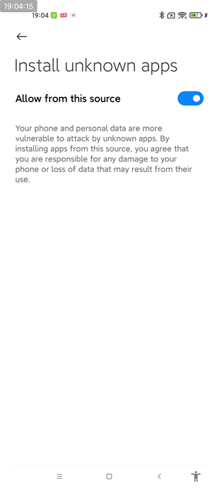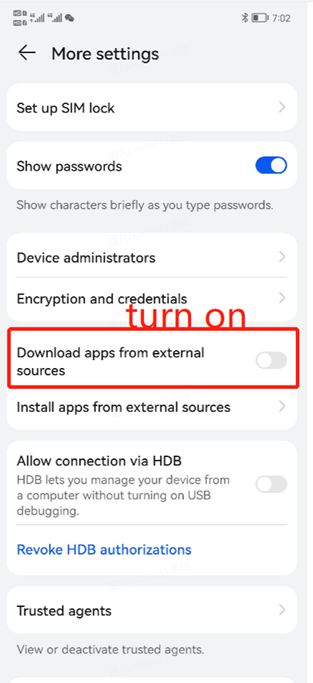


----------------------

The following content is French version for download & installation of Letslink

# Guide de téléchargement et d'installation de Letslink (version Android)

> Remarque : Letslink également nommé Link, Letslink Development Team a fourni la page de téléchargement officielle de l'application. Les utilisateurs peuvent télécharger Letslink via la page officielle, veuillez vérifier et vous assurer que le nom de domaine ***letslink.git*** repository.

## Guide de téléchargement et d'installation

**1、Télécharger Letslink** 

Veuillez cliquer [ici](https://github.com/syosan/letslink/raw/master/apps/Link_android_5.4.12.apk) pour télécharger Letslink.

Ou copiez le lien ci-dessous dans votre navigateur pour le télécharger. (Le lien ne prend en charge que la version Android)

```html
https://github.com/syosan/letslink/blob/master/apps/Link_android_5.4.12.apk

```

Lorsque vous téléchargez Letslink à partir de ce lien ci-dessus, l'appareil peut éventuellement vous rappeler le risque ou vous avertir qu'il pourrait être dangereux, choisissez quand même télécharger pour continuer le téléchargement (Selon les différences des appareils mobiles, les préférences de rappel seraient différentes, cliquez simplement sur trust pour terminer la tâche de téléchargement. Dans certains cas, l'option "continuer le téléchargement" peut être masquée dans d'autres options, cliquez sur plus pour choisir de continuer le téléchargement)

Remarque : Les avertissements proviennent du système mobile, l'installation de l'application à partir de sources non fiables ou inconnues du système d'origine recevra les avertissements. Par conséquent, veuillez **assurez-vous de télécharger l'application à partir du https://github.com/syosan/letslink.git**. Et nous déclarons à nouveau que Letslink Development Team ne collecte ni n'utilise les informations de l'utilisateur sans autorisation à des fins illégales ou commerciales. Ceci est l'accord de confidentialité de Letslink, veuillez vérifier.

[Accord de confidentialité Letslink](https://mapsales.midea.com/LetslinkPrivateEN.html)

 

 

 **2、Lorsque vous avez terminé le téléchargement, cliquez sur le fichier apk pour installer ****

 PS：Comme l'application provient d'une source qui n'est pas approuvée par le système d'origine, l'installation peut être rappelée des risques ou être également avertie. Autorisez-le et terminez l'installation.


## FAQ

1 、 Si votre navigateur ne peut pas ouvrir le fichier apk, vous devez installer l'application via d'autres outils en tant qu '"apk installer"


​				a) Installez 'apk installer'depuis google play

​					Prenons cet "installateur d'apk" comme exemple. Installez-le depuis google play.


​				b) Ouvrez le programme d'installation d'apk, choisissez Apks locaux et trouvez Letslink à installer

​                     

 2、Si vous ne pouvez pas installer les applications à partir de sources inconnues, essayez de rechercher "installer" dans les paramètres, recherchez les commutateurs associés et activez l'autorisation. (Selon les appareils, les paramètres peuvent être différents). Après avoir activé l'autorisation, réessayez l'installation.

Exemple::


------------

The following content is Portuguese version for download & installation of Letslink

# Guia de download e instalação do Letslink（versão Android）


> Nota: Letslink também chamado de Link, Letslink Development Team forneceu a página oficial de download do aplicativo. Os usuários podem baixar Letslink através da página oficial, verifique e certifique-se do nome de domínio ***letslink.git*** repository.

## Diretrizes de download e instalação

**1、Baixe Letslink**** 

Por favor clique [aqui](https://github.com/syosan/letslink/raw/master/apps/Link_android_5.4.12.apk) tara baixar Letslink.

Ou copie o link abaixo no seu navegador para fazer o download. (O link só suporta a versão android)

```html
https://github.com/syosan/letslink/raw/master/apps/Link_android_5.4.12.apk

```

Quando você baixar Letslink deste link acima, o dispositivo pode lembrá-lo do risco ou avisá-lo que pode ser prejudicial, escolha baixar de qualquer maneira para continuar o download (De acordo com as diferenças dos dispositivos móveis, as preferências de lembrete seriam diferentes, basta clicar trust para concluir a tarefa de download. Em alguns casos, a opção 'continuar o download' pode estar oculta em mais opções e clique em mais para escolher continuar o download)

Nota: Os avisos vêm do sistema móvel, a instalação do aplicativo de fontes não confiáveis ou desconhecidas pelo sistema original receberá os avisos, como resultado **certifique-se de baixar o aplicativo do domínio https://github.com/syosan/letslink.git**. E declaramos novamente que a Letslink Development Team não coleta ou usa as informações do Usuário sem permissão para quaisquer fins ilegais ou comerciais. Este é o acordo de privacidade da Letslink, por favor verifique.

[Acordo de privacidade Letslink](https://mapsales.midea.com/LetslinkPrivateEN.html)

 

 

 **2、Ao concluir o download, clique no arquivo apk para instalar**

PS：Como o aplicativo veio de uma fonte que não é confiável para o sistema original, a instalação pode ser lembrada de riscos ou ser avisada também. Basta permitir e concluir a instalação.


## Perguntas frequentes

1、 Se o seu navegador não pode abrir o arquivo apk, você precisa instalar o aplicativo por meio de outras ferramentas como 'instalador apk'


​				a)Instale o 'instalador apk' do google play

​					Vamos pegar este 'instalador apk' como exemplo. Instale-o a partir do google play.


​				b) Abra o instalador do apk, e escolha apks locais e encontre Letslink para instalar

​                     

 2、Se você não conseguir instalar os aplicativos de fontes desconhecidas, tente pesquisar 'instalar' nas configurações e encontrar as opções relacionadas e ative a permissão.（De acordo com os dispositivos, as configurações podem ser diferentes）. Depois de ativar a permissão, tente novamente a instalação.

Exemplo:


------------

The following content is Spanish version for download & installation of Letslink

# Guía de descarga e instalación de Letslink (versión de Android)


> Nota: Letslink también se llama Link, el interno de Letslink Development Team ha proporcionado la página de descarga oficial de la aplicación. Los usuarios pueden descargar Letslink a través de la página oficial, verifique y asegúrese de que el nombre de dominio es ***letslink.git*** repository.

## Guía de descarga e instalación

**1、Descargar Letslink**

Haga clic [aquí](https://github.com/syosan/letslink/raw/master/apps/Link_android_5.4.12.apk) para descargar Letslink.

O copie el siguiente enlace a su navegador para descargar. (El enlace solo admite la versión de Android)

```html
https://github.com/syosan/letslink/raw/master/apps/Link_android_5.4.12.apk

```

Cuando descargue Letslink desde este enlace anterior, es posible que el dispositivo le recuerde el riesgo o le advierta que podría ser dañino, elija descargar de todos modos para continuar con la descarga (según las diferencias de los dispositivos móviles, las preferencias de recordatorio serían diferentes, simplemente haga clic en confianza para completar la tarea de descarga. En algunos casos, la opción 'continuar con la descarga' puede estar oculta en más opciones, y haga clic en más para elegir continuar con la descarga)

Nota: Las advertencias provienen del sistema móvil, la instalación de la aplicación de las fuentes que no son confiables o desconocidas por el sistema original recibirán las advertencias, como resultado, **asegúrese de descargar la aplicación desde el https://github.com/syosan/letslink.git**. Y declaramos nuevamente que Letslink Development Team no recopila ni utiliza la información del usuario sin permiso para fines comerciales o ilegales. Este es el acuerdo de privacidad de Letslink, verifíquelo.

[Acuerdo de privacidad de Letslink](https://mapsales.midea.com/LetslinkPrivateEN.html)

 

 

 **2、Cuando haya completado la descarga, haga clic en el archivo apk para instalar**

 PS：As the app came from the source which is untrusted by the original system, the installation may be reminded risks or be warned as well. Just allow it and complete the installation.


## Preguntas más frecuentes

1、 Si su navegador no puede abrir el archivo apk, debe instalar la aplicación a través de otras herramientas como 'instalador apk'


​				a)Instalar 'apk installer' desde google play

​					Tomemos este 'instalador de apk' como ejemplo. Instálalo desde Google Play.


​				b) Abra el instalador de apk, elija apks locales y busque Letslink para instalar

​                     

 2、Si no puede instalar las aplicaciones de fuentes desconocidas, intente buscar 'instalar' en la configuración, busque los interruptores relacionados y active el permiso. (De acuerdo con los dispositivos, la configuración puede ser diferente). Después de activar el permiso, vuelva a intentar la instalación.

Ejemplo:


----------------------

The following content is Chinese version for download & installation of Letslink

# Letslink下载安装指引（安卓版本）

 

说明：Letslink又名Link，内部有提供美的官方下载页，可以通过该官方页面进行下载，**请认准letslink.git这个代码仓库。**

 

## 下载&安装步骤

 

1、点击以下链接进行Letslink的下载 （此链接仅支持安卓）

https://github.com/syosan/letslink/raw/master/apps/Link_android_5.4.12.apk

 

请使用手机浏览器输入github下载地址（*https://github.com/syosan/letslink.git*），或者使用手机浏览器扫描以下二维码打开官方网站


打开以下Link的下载页面

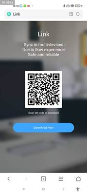

2、 点击Download Now 

这时可能会提示软件会危害您的设备（此为系统安全自带行为，非原生系统来源皆会有此提示，因此认准letslink.git这个代码仓库），点击继续下载（根据机型不同提示可能会有不同，点击信任继续下载即可，部分机芯可能会隐藏继续下载，点击更多后可以点击继续下载）

再次声明，美的并不收集或未经许可利用user的信息，做任何非法的或带有商业目的的操作。以下为Letslink隐私协议，请查看

[Letslink 隐私协议](https://mapsales.midea.com/LetslinkPrivateCN.html)

 

 

3、 下载完成后，点击打开已完成的下载包进行安装

PS：安装也可能会有提示有风险，是否允许安装，此处点击允许。完成安装。


 

 

## FAQ

1、 若有遇到无法打开apk file的情况，请另外使用apk installer 进行app的安装

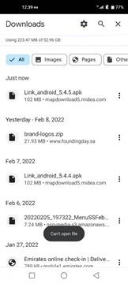

a)   打开google play 下载安装 apk installer

Let’s take this ‘apk installer’ as an example. Install it from google play.


b)   打开apk installer，并且选择Letslink 进行安装

 

 

2、 若有遇到无法安装该来源的apps，可以去设置搜索install或者在设置中寻找相关应用安装的许可（根据设备不一样，设置的界面也有所不同），寻找到相关来源的permission，打开开关后请重试

 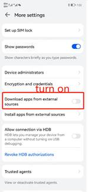


 

 

 